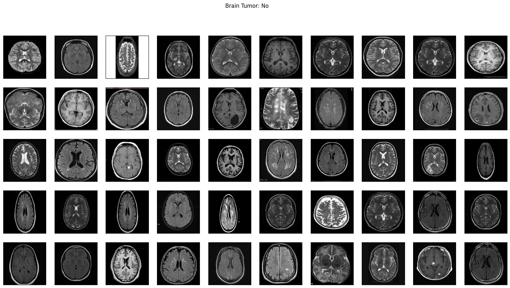
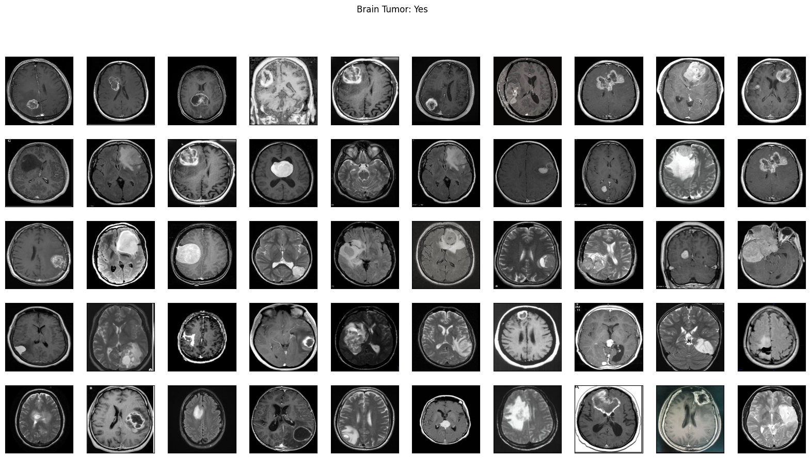
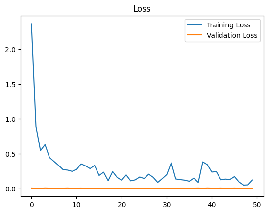
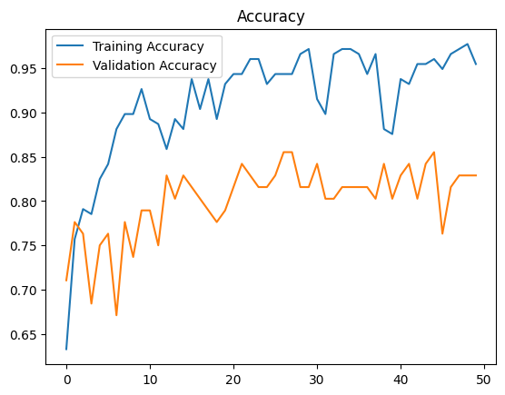
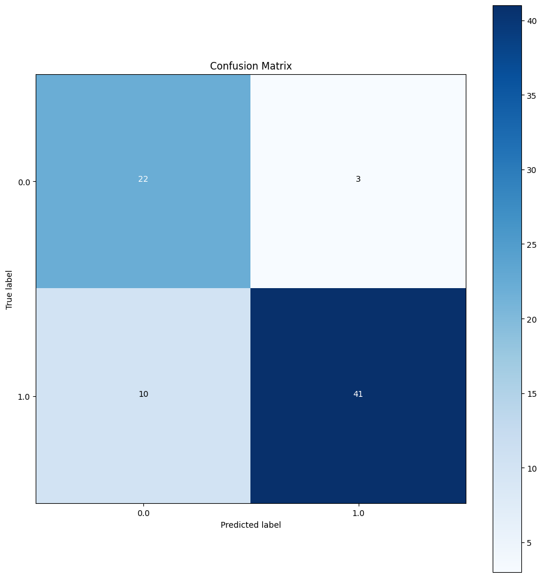
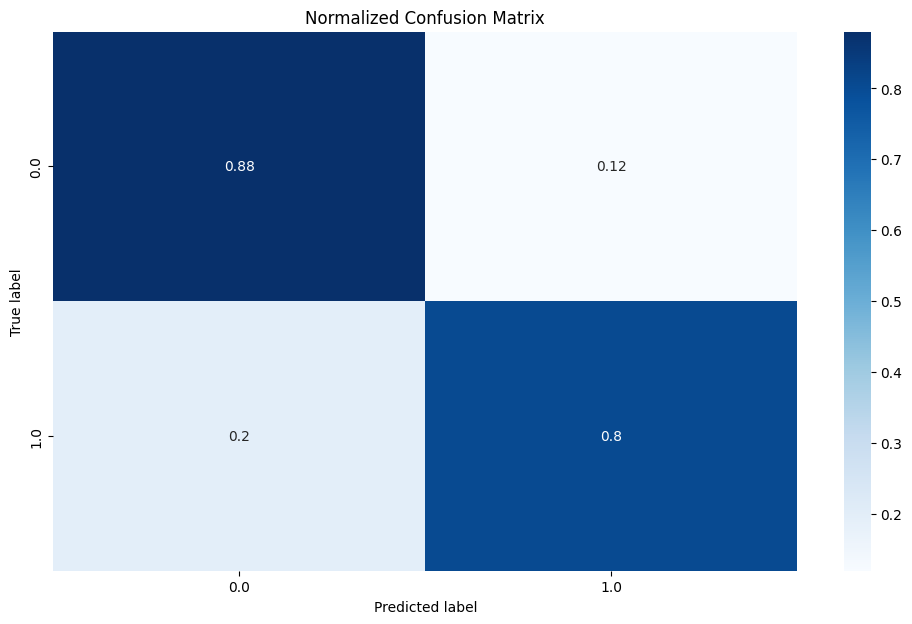

# Brain Tumor Detection

## Overview
This repository contains code for a deep learning model to detect brain tumors using MRI images. The model is trained on a dataset consisting of MRI images labeled with tumor presence or absence.

## Dataset
The dataset used for training and evaluation consists of MRI images categorized into two classes: 
- "Yes" indicating the presence of a brain tumor.
- "No" indicating the absence of a brain tumor.

The dataset is divided into training and validation sets to train and evaluate the model's performance.

## Data Loading and Preprocessing
Images are read using OpenCV and resized to 240x240 resolution. They are normalized to values between 0 and 1. Labels are assigned as 1 for 'yes' and 0 for 'no'.

```python
X, y = load_data([data_yes, data_no], (240, 240))
```

A utility function is used to display a sample of MRI images from each class.

```python
plot_sample_images(X, y, n=50)
```

<p align="center">
  
  
</p>

Then the dataset is split into training and testing sets:

```python
X_train, y_train, X_test, y_test = split_data(X, y, test_size=0.3)
```

## Model Architecture
The model architecture is implemented using PyTorch. It includes convolutional layers, dropout, and max pooling, followed by a linear layer with sigmoid activation for binary classification.

```python
class BrainDetectionModel(nn.Module):
    def __init__(self, input_shape):
        ...
```

Model summary:

```
Total params: 11,073
Trainable params: 11,073
```

## Training
The model is trained using the Adam optimizer and binary cross-entropy loss for 50 epochs. Accuracy and loss metrics are recorded for both training and validation sets. Training is performed on GPU if available.

```python
train_dataset(model, train_loader, validation_loader)
```

### Example Training Logs
```
Epoch [1/50] Train Acc: 0.6328, Val Acc: 0.7105
...
Epoch [50/50] Train Acc: 0.9548, Val Acc: 0.8289
```

## Results

### 📈 Performance Curves
Training and validation loss and accuracy over epochs:

```python
plt.plot(train_losses, label='Training Loss')
plt.plot(val_losses, label='Validation Loss')
```

```python
plt.plot(traning_accuracy, label='Training Accuracy')
plt.plot(val_accuracy, label='Validation Accuracy')
```

<p align="center">
  
  
</p>

### 🔍 Confusion Matrix
Confusion matrix and normalized confusion matrix are plotted using matplotlib and seaborn:

```python
confusion_matrix(y_true, y_predict)
sn.heatmap(df_cm, annot=True, cmap="Blues")
```
<p align="center">
  
  
</p>

### 💯 Final Evaluation
- **F1 Score**: 0.8632

## Requirements
- Python 3.x
- PyTorch
- torchvision
- numpy
- matplotlib
- scikit-learn
- seaborn
- OpenCV

## Notes
This model demonstrates robust performance in detecting brain tumors using a lightweight CNN. The high F1 score and stable validation accuracy show the model's effectiveness in real-world medical imaging scenarios.
